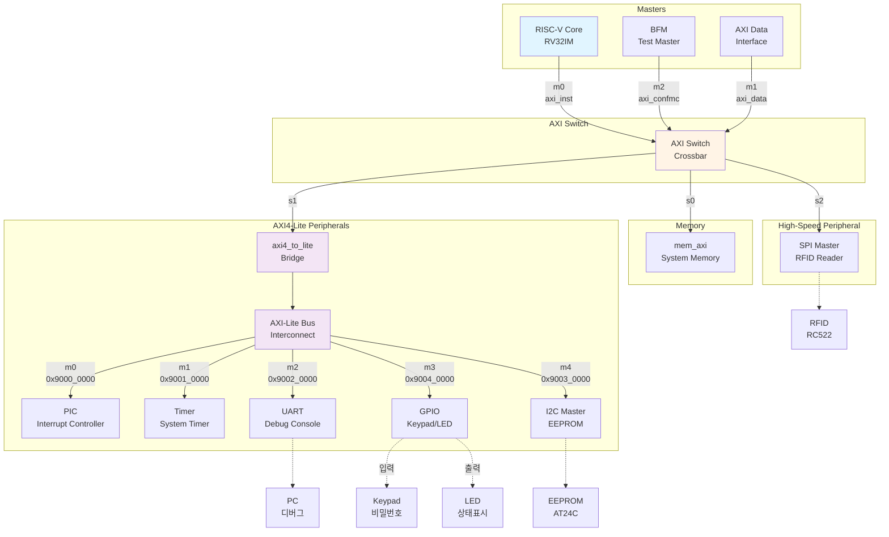
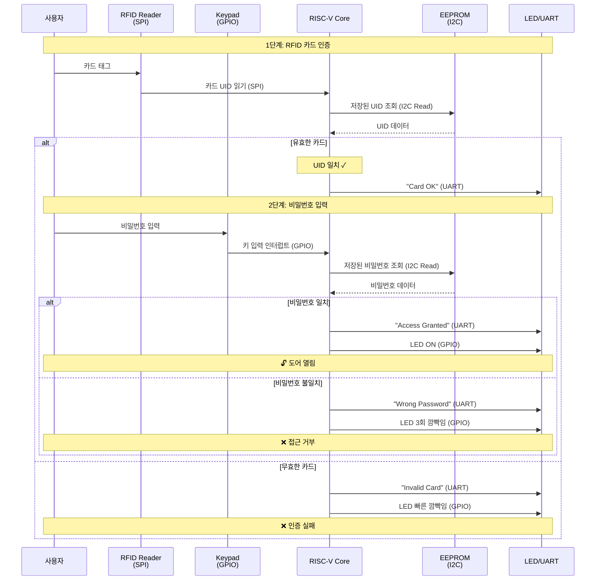

# Team2

## 시스템 아키텍처

### 1. 하드웨어 구조 (Hardware Architecture)

### 2. 도어락 동작 흐름 (Door Lock Operation Flow)

### 3. 메모리 맵 (Memory Map)

| 주소 | Peripheral | 설명 |
|------|-----------|------|
| `0x9000_0000` | **PIC** | Programmable Interrupt Controller |
| `0x9001_0000` | **Timer** | System Timer |
| `0x9002_0000` | **UART** | Debug Console / Status Output |
| `0x9003_0000` | **I2C** | EEPROM Controller (비밀번호 저장) |
| `0x9004_0000` | **GPIO** | Keypad Input / LED Output |
| `0x4xxx_xxxx` | **SPI** | RFID Reader (via AXI Switch s2) |

---

## RISC-V 기반 보안 접근 제어 플랫폼

---

## 프로젝트 개요
본 프로젝트는 **Xilinx ZedBoard (Zynq-7000 SoC FPGA)**를 기반으로 **RISC-V Core**를 탑재하고,  
**AXI-Lite Bus 표준**에 따라 설계된 Peripheral을 통합하여 **HW/SW Co-design 기반의 Door Lock 시스템**을 구현합니다. 추가적으로 **오디오(I²S/PWM)** 및 **RFID(SPI)** 기능을 확장하는 것을 목표로 합니다.

---

## 프로젝트 목표
- **SoC 아키텍처 및 Co-design 역량 확보**  
  - RISC-V Core와 AXI-Lite Bus를 활용하여 시스템 통합 아키텍처 구축  
  - Peripheral FSM/Register Map 설계 및 제어 → HW/SW 공동 설계 능력 배양  

- **핵심 Peripheral RTL 구현**  
  - GPIO, UART, I²C 등 필수 임베디드 Peripheral RTL 직접 설계  
  - EEPROM 활용 데이터 저장/관리 로직 구현 → 시스템적 사고력 증진  

- **시스템 검증 및 신뢰성 확보**  
  - Testbench 기반 시뮬레이션 및 FPGA 포팅  
  - Door Lock 로직의 기능적 신뢰성 확보, 디버깅 경험 축적

- **추가 확장 기능**
  - **오디오 출력(I²S/PWM):** 인증 성공/실패에 따른 효과음 출력
  - **RFID 인증(SPI):** 카드 UID 기반 인증 기능 추가

---

##  세부 구성요소

### 1. RISC-V Core (RV32I)
- 5-stage Pipeline (IF, ID, EX, MEM, WB)
- AXI-Lite Master로 동작, Peripheral 접근 제어

### 2. AXI-Lite Interconnect
- CPU와 Peripheral 간 데이터 전송
- Memory-Mapped IO 방식 (주소 기반 접근)

### 3. GPIO
- **입력:** Keypad → 비밀번호 입력
- **출력:** LED → Access 결과 표시
- Register Map을 통한 제어 및 상태 확인

### 4. UART
- PC ↔ FPGA 통신
- Debug Log 출력 (“Access Granted/Denied”)
- 관리자 모드에서 비밀번호 초기화 가능

### 5. I²C (EEPROM)
- 비밀번호 저장/읽기
- FSM 기반 Start → Addr → Data R/W → Stop 동작
- Busy/ACK 플래그 제공

### 6. Door Lock FSM
- 상태: Idle → Input → Compare → Granted/Denied → Reset
- 3회 이상 실패 시 Lockdown 모드 진입
- LED/UART/Audio 제어 신호 발생

### 7. 오디오 모듈 (확장)
- **I²S CODEC:** 헤드폰/스피커 효과음 출력
- **PWM 부저:** 단순 비프음 패턴 구현

### 8. RFID 모듈 (확장)
- SPI Master ↔ RFID Reader 통신
- 카드 UID 획득 후 EEPROM 저장 UID와 비교
- UID 일치 시 Access Granted

---

## 검증 방법 (Verification)
- **단위 모듈 검증**  
  - 각 Peripheral RTL에 대한 Testbench 작성  
  - Simulation 파형 분석을 통한 동작 검증  

- **AXI-Lite Bus 검증**  
  - Core ↔ Peripheral 간 AXI-Lite 트랜잭션 정상 동작 여부 확인

- **시스템 기능 시연**  
  - **정상 동작 : ** 올바른 비밀번호 입력 → PC에 `"Access Granted"` 출력, LED ON  
  - **오류 동작 : ** 잘못된 비밀번호 입력 → PC에 `"Access Denied"` 출력, LED 3회 깜빡임  

---

## 개발 환경 (Development Environment)
**플랫폼** ZedBoard (Xilinx Zynq-7000 series SoC FPGA)\
**EDA Tool** Vivado 2021.2\
**OS / Toolchain** Ubuntu 22.04, RISC-V GCC Toolchain

