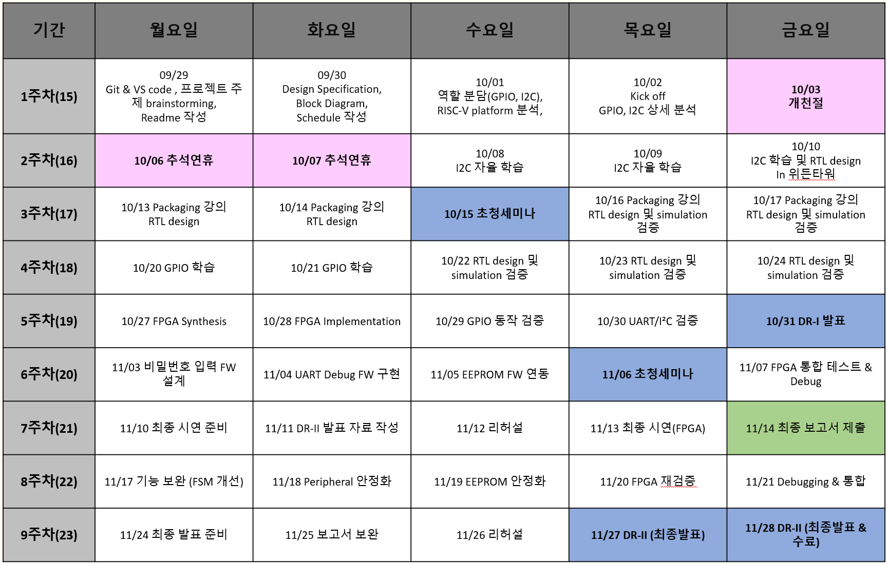

#  Door Lock System 프로젝트 일정 (확장 기능 포함)
   
 

## 1주차 (09/29 ~ 10/03)

### 09/29 (월)
- vault 요구사항 브레인스토밍 (필수/선택 기능 구분)
- GitHub/Notion 프로젝트 공간 생성
- README.md 작성

### 09/30 (화)
- Use Case Diagram 작성 (사용자 입력/출력 흐름)
- 기능 정의서 작성 (비밀번호 입력 → 검증 → 결과 표시)
- Peripheral 초기 목록 정리 (GPIO, UART, I²C, SPI, I²S)

### 10/01 (수)
- 역할 분담 (GPIO,I2C)
- RISC-V 플랫폼 분석 (IP 파악)
- 블록 다이어그램 스케치 (RISC-V ↔ AXI ↔ Peripheral 구조)

### 10/02 (목)
- Kick-off,
- GPIO, I2C 상세 분석 (레지스터 맵 초안 구상)

### 10/03 (금)
- 휴강일 →  I2C 자율 학습

---

## 2주차 (10/06 ~ 10/10)

### 전일 (월~수)
- 추석 연휴
- **과제**: 8~9 I2C 자율 학습/ 10 위든타워 자율 출근 및 I2C 자율 학습/RTL design

---

## 3주차 (10/13 ~ 10/17)

### 10/13 (월)
- Packaging 강의, RTL design

### 10/14 (화)
- Packaging 강의, RTL design

### 10/15 (수)
- **초청 세미나 참석**

### 10/16 (목)
- Packaging 강의, RTL design 및 simulation 검증

### 10/17 (금)
- Packaging 강의, RTL design 및 simulation 검증

---

## 4주차 (10/20 ~ 10/24)

### 10/20 (월)
- GPIO 학습

### 10/21 (화)
- GPIO 학습

### 10/22 (수)
- RTL design 및 simulation 검증

### 10/23 (목)
- RTL design 및 simulation 검증

### 10/24 (금)
- RTL design 및 simulation 검증

---

## 5주차 (10/27 ~ 10/31)

### 10/27 (월)
- Vivado Synthesis 실행, Pin Mapping 반영

### 10/28 (화)
- Implementation (Place & Route), Timing Report 확인

### 10/29 (수)
- GPIO FPGA 검증 (Keypad 입력 → LED 반응)

### 10/30 (목)
- UART FPGA 검증 (PC ↔ FPGA 문자 송수신)
- I²C EEPROM Write/Read 테스트

### 10/31 (금)
- **DR-I 발표**: Simulation + FPGA 1차 결과 공유

---

## 6주차 (11/03 ~ 11/07)

### 11/03 (월)
- 비밀번호 입력 FW 설계 (Keypad 스캔 코드 해석)
- EEPROM API 설계

### 11/04 (화)
- UART Debug FW 구현

### 11/05 (수)
- EEPROM FW 연동 (비밀번호 저장/검증)

### 11/06 (목)
- **초청 세미나 참석**
- 세미나 정리

### 11/07 (금)
- FPGA 통합 Test (FSM + FW)
- Debugging: LED Blinking + UART 로그

---

## 7주차 (11/10 ~ 11/14)

### 11/10 (월)
- 최종 시연 시나리오 준비 (성공/실패/Lockdown)

### 11/11 (화)
- DR-II 발표자료 작성

### 11/12 (수)
- 리허설 (보드 실연 + 발표자 교체 연습)

### 11/13 (목)
- **DR-II FPGA 시연**

### 11/14 (금)
- 최종 보고서 제출

---

## 8주차 (11/17 ~ 11/21) — 확장 기능 설계

### 11/17 (월)
- SPI RTL 설계 (Master FSM, MOSI/MISO, CLK)

### 11/18 (화)
- I²S/PWM RTL 설계 (Frame Sync, Data Out)

### 11/19 (수)
- SPI Testbench 작성 (UID 송수신)

### 11/20 (목)
- I²S Testbench 작성 (사운드 출력 파형 확인)

### 11/21 (금)
- Simulation & Debugging (SPI/I²S 모두)

---

## 9주차 (11/24 ~ 11/28) — 확장 기능 검증

### 11/24 (월)
- SPI RFID 모듈 FPGA 검증 (카드 UID 판별)

### 11/25 (화)
- I²S FPGA 검증 (오디오 출력)

### 11/26 (수)
- Firmware Driver 설계 (SPI/I²S 제어)

### 11/27 (목)
- **DR-III 발표 준비** (확장 기능 포함)

### 11/28 (금)
- **DR-III 최종 발표 & 수료**

